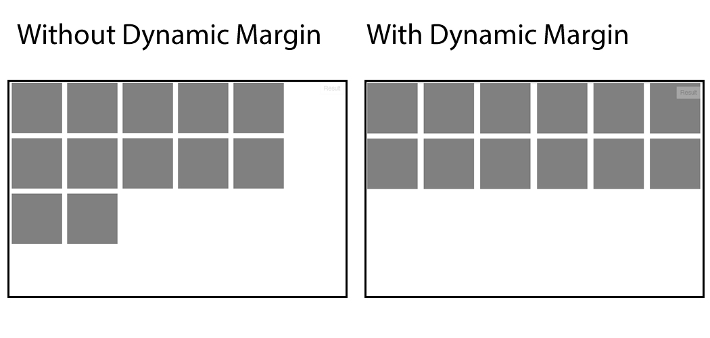

jQuery Dynamic Margin
==============

## Save media queries!

### What is this plugin?

jQuery Dynamic Margin positions floated elements dynamically, avoiding blank spaces on window resize or when the site is loaded on smaller screens.

### Example



<a href="http://jsfiddle.net/pietrofxq/MTgD6"> CHECK THE LIVE DEMO</a>

## How to use

### Notes

By default, the plugin will assume that the container of your elements is the window. Is **crucial** that you define the correct container of your elements, because if you do not, the margin will be calculate in the wrong way and will bug everything.

### Basic Usage

```js

$(document).ready(function(){
	
	$('.element').dynamicMargin({
		container: '.container'
	});
})

```

### Default Options


```js

$('.element').dynamicMargin({
	container: window,
	minMargin: 10,
    onResizeWindow: false,
    onResizeAndLoad:false,
    bodyReset:true
});

```

### Options

This option let you choose the container of the elements that needs the dynamic margin. This is important because the calculation uses the container width in order to work.

```js
container: window
```

This option set the minimum margin-left and margin-right to the elements (in px).

```js
minMargin: 10
```

This option makes the plugin get fired *only* when the window is resized (true or false).

```js
onResizeWindow: false
```
This option is same as the previous, but the plugin is also fired when the page loads

```js
onResizeAndLoad: false
```

By default, when the container is the window, the plugin automatically sets ```margin:0; padding:0``` to the body, to prevent bugs. You can set this option to false to disable this behavior

```js
bodyReset: true
```

Disable Dynamic Margin

```js
$('.element').dynamicMargin('destroy');
```

## Feel free to collaborate!